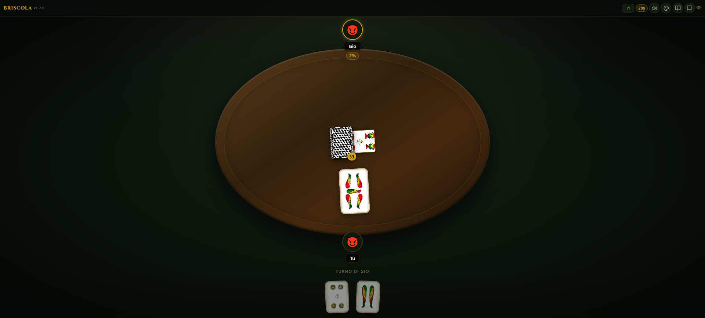
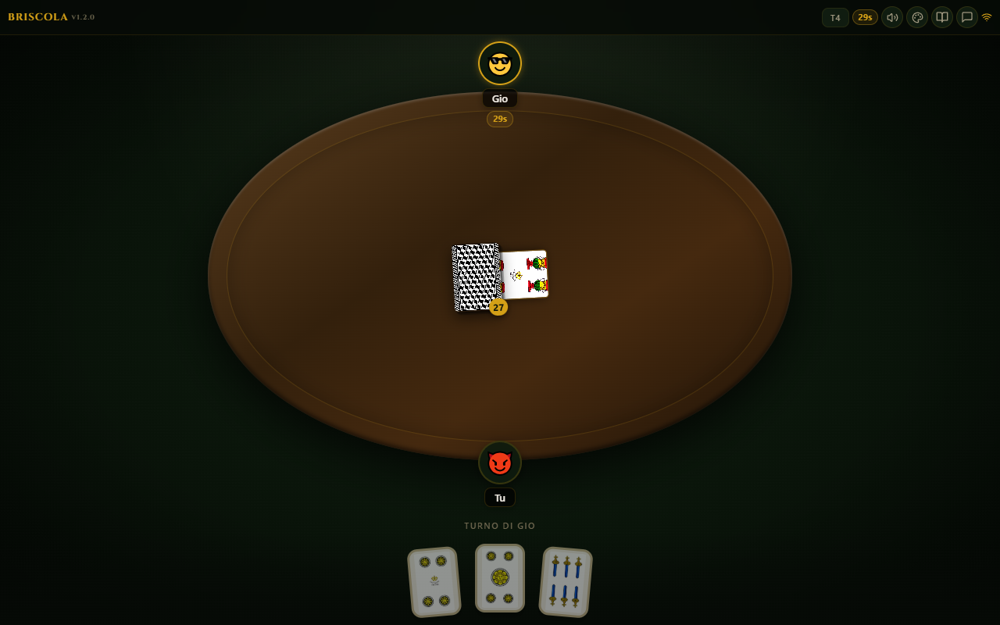
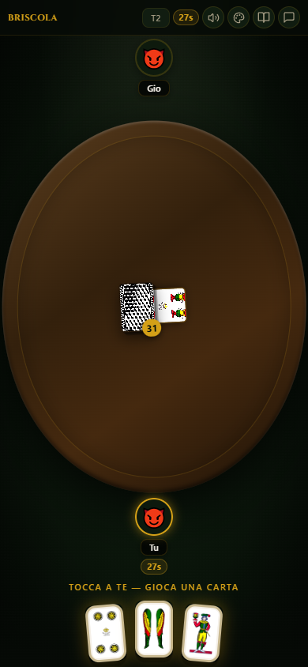

# 🃏 Briscola Napoletana

Gioca a Briscola online con **carte napoletane vere**, multiplayer in tempo reale, tavolo rotondo professionale e giro anti-orario come la Briscola vera.


**🔗 Gioca ora:** [briscola-online.vercel.app](https://briscola-online.vercel.app)

---

## 📸 Anteprime

### 🏠 Home


### 🎮 Tavolo da gioco — Desktop


### 📱 Tavolo da gioco — Mobile


---

## ✨ Caratteristiche

### 🎮 Modalità di gioco
- **1v1** — Duello testa a testa, 2 smazzate su 120 punti
- **3 per Tutti** — Tutti contro tutti, smazzata singola
- **2v2 Squadre** — Battaglia a squadre con compagni di fronte, 2 smazzate

### 🌐 Multiplayer online
- **Sincronia real-time** — Playroom Kit per stato di gioco istantaneo
- **Codici stanza** — Codici a 4 caratteri da condividere
- **Link invito** — URL condivisibili con auto-join
- **QR Code** — Genera QR per inviti rapidi
- **Cross-platform** — Desktop e mobile

### 🃏 Carte napoletane
- **Mazzo napoletano autentico** — Denari, Coppe, Spade, Bastoni
- **Valori italiani** — Asso, Due, Tre... Fante, Cavallo, Re
- **Retro napoletano** — immagine reale

### 🎯 Regole Briscola
- **Giro anti-orario** — come il gioco vero
- **Chi vince la mano guida la prossima**
- **2 smazzate per 1v1 e 2v2** — somma dei punteggi determina il vincitore
- **Mostra carte all'ultima mano** in 2v2
- **Timer turno** con auto-play allo scadere

### 🎨 Design professionale
- **Tavolo rotondo** ovale con feltro verde
- **5 colori tavolo** selezionabili
- **Effetti sonori** sintetizzati (Web Audio)
- **Chat veloce** integrata
- **Tema scuro** elegante con accenti oro Napoli

---

## 🚀 Come iniziare

### Prerequisiti
- Node.js 18+
- npm

### Installazione
```bash
git clone https://github.com/inferis995/briscola-napoletana.git
cd briscola-napoletana
npm install
npm run dev
```

Apri [http://localhost:3000](http://localhost:3000)

### Build produzione
```bash
npm run build
npm start
```

---

## 🛠 Tech Stack
- **Frontend:** React 18 + Next.js 14 (App Router)
- **Styling:** Styled Components v6
- **Multiplayer:** Playroom Kit
- **QR Code:** qrcode.react
- **Icone:** lucide-react
- **Audio:** Web Audio API (sintetizzato)
- **Type Safety:** TypeScript

---

## 📝 Licenza
MIT License — libero utilizzo.

---

## 🤝 Contributi
Contributi benvenuti! Fork, issue e pull request.
